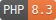

# GOV.UK Laravel

Use the GOV.UK Design System within the Laravel ecosystem, complete with Blade components and templates!

## Legal
GOV.UK Laravel is a community resource of the [GOV.UK Design System](https://design-system.service.gov.uk).

The Design System team is not responsible for it and cannot support you with using it.

Contact Anthony Edmonds directly if you need help, or you want to request a feature.

Published under the MIT licence.

## What's in the box?

* [GOV.UK Design System](https://design-system.service.gov.uk) version 5.9
* [Inter](https://fonts.google.com/specimen/Inter), a free close replacement for the official GOV.UK font
* Laravel 11 Blade components of the GOV.UK Design System components
* Laravel 11 Blade templates of the main GOV.UK Design System pages
* Laravel 11 Rules for dates, times, and words
* PHP 8.3 Classes to support the creation of standard and custom pages

## Documentation

### Getting Started
* [Installation](docs/install.md)
* [Configuration](docs/configuration.md)
* [Roadmap](docs/roadmap.md)
* [Upgrading](docs/upgrade.md)

### GOV.UK Design System
* [Components](docs/components.md)
* [Extensions](docs/extensions.md)
* [Page Layouts](docs/layout.md)
* [Pages](docs/pages.md)

### Laravel & Classes
* [Forms](docs/forms.md)
* [Markdown](docs/markdown.md)
* [Page](docs/classes/page.md)
* [Rules](docs/rules.md)

## Contribution

Feel free to submit ideas and features as issues, and raise pull requests.
